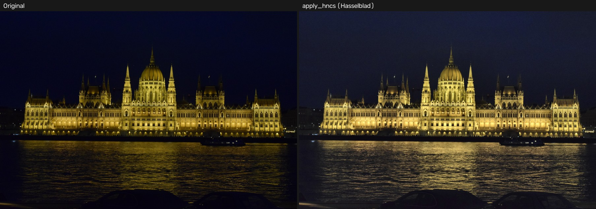
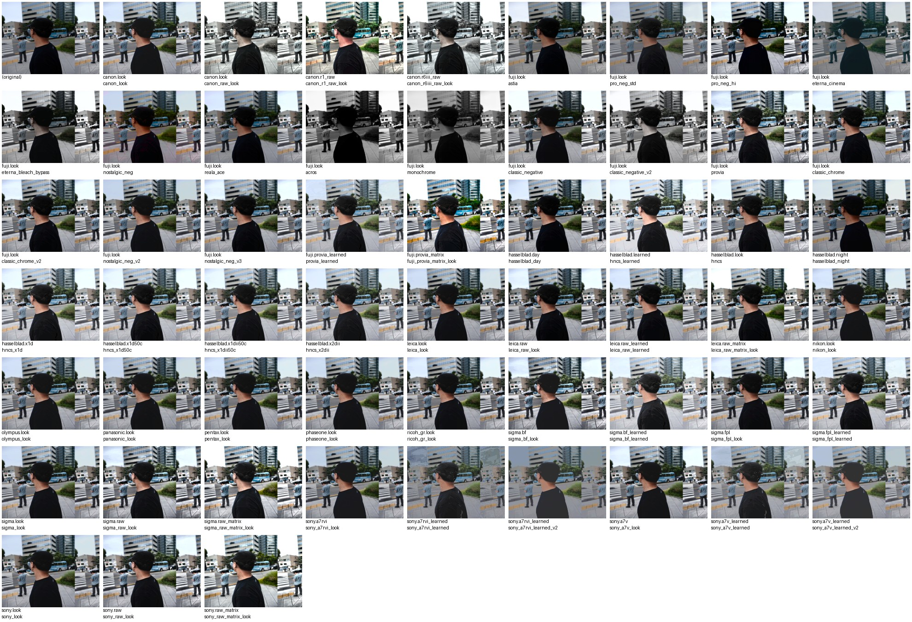
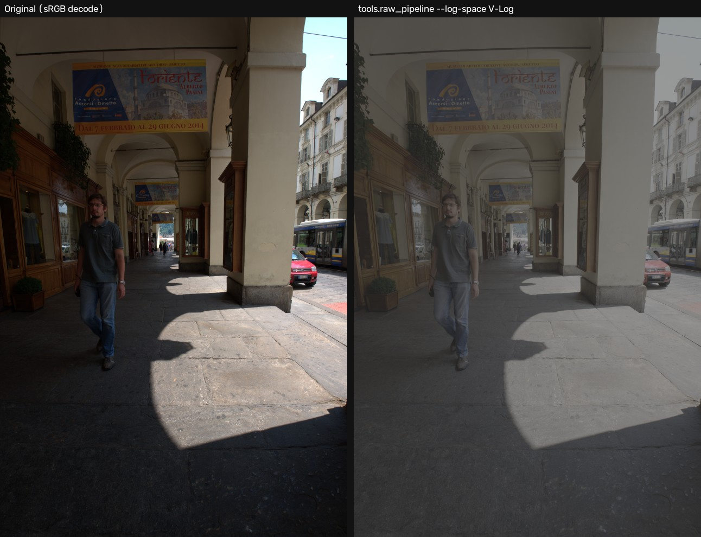
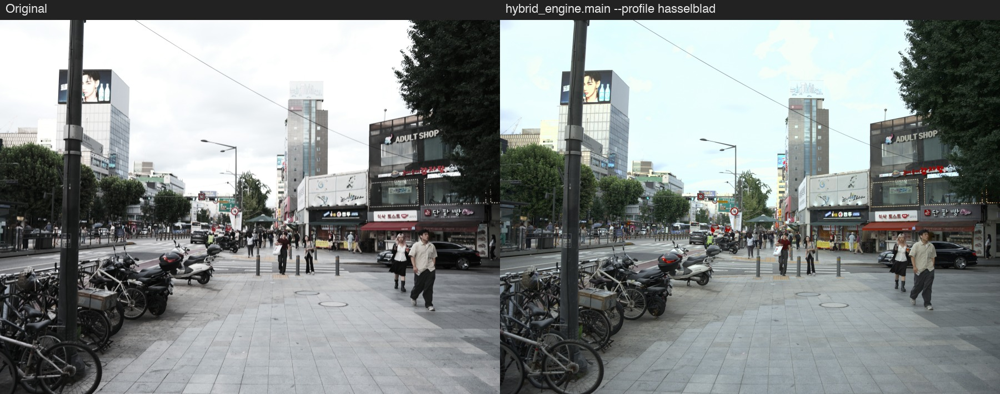
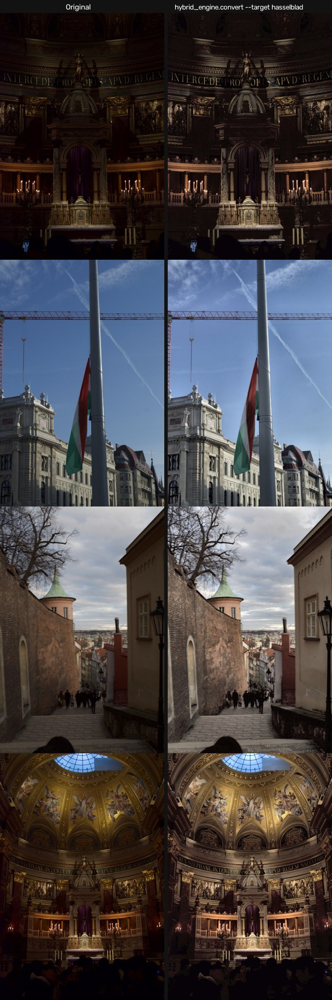

# HNCS

*[English README](README.md)*

[](https://github.com/songjiun10-collab/Hncs/actions/workflows/tests.yml)

[](LICENSE)

카메라/디지털백 제조사별 공식(또는 공식에 준하는) 샘플 이미지를 실측
분석해서 각 브랜드의 색과학을 코드로 근사하는 프로젝트. 원래 핫셀블라드
HNCS(Hasselblad Natural Colour Solution) 하나만 다뤘는데, 같은 방법론을
11개 브랜드로 확장했다.

## TL;DR

- **12개 브랜드** 색감 근사: Hasselblad/Fujifilm/Leica/Phase One/Pentax/
  Ricoh GR/Canon/Nikon/Sony/Panasonic/Olympus/Sigma
- 전부 **공식 샘플 이미지 실측**에 근거 - population-fit 10개 브랜드
  총 834장 + 핫셀블라드 raw+jpeg 페어 캘리브레이션(2026-08 기준 카메라
  4세대 74쌍, 파라메트릭 RMSE 19.94 - [docs/measurements.md](docs/measurements.md#로컬-기여-데이터셋으로-세대-간-pooling-첫-실측-2026-08-local-mixed-2026-07)
  참고)
- 픽셀 단위 **5종 시그니처 분석**(tone/color/texture/gamut/joint
  distribution)으로 브랜드별 색과학을 데이터로 기록
- **population 통계 재현성 감사 10/10 일치** - 커밋된 모든 수치가
  캐시 이미지로 처음부터 재계산해도 그대로 나옴을 확인함(2026-07)
- `unittest` 테스트 스위트 + GitHub Actions CI로 push/PR마다 자동 검증





*동일한 소스 사진(Nikon D5300 야경샷, 데모용으로 제공받음) 한 장에
`brands/*.py`의 사진용 `apply_*` 룩 24개(+원본)를 그대로 돌린 결과. 공식
캘리브레이션 소스 사진이 아니라 단순 데모용 - 실제 population 수치의
근거는 [지원 브랜드](#지원-브랜드) 표에 링크된 문서를 참고.*

## 지원 브랜드

| 브랜드 | 검증 방식 | 근거 |
|---|---|---|
| ✅ Hasselblad | raw+jpeg 페어 캘리브레이션(그리드서치 + 학습 LUT) | [docs/measurements.md](docs/measurements.md) |
| ✅ Fujifilm | 필름시뮬레이션 프리셋 11종, population + 동일장면 비교차트 + raw+jpeg(Provia) | [docs/brands.md](docs/brands.md#후지필름-brandsfujipy) |
| ✅ Leica | population-fit (SOOC JPEG 45장) | [docs/brands.md](docs/brands.md#라이카-brandsleicapy) |
| ✅ Phase One | population-fit (Capture One 렌더링 기준) | [docs/brands.md](docs/brands.md#phase-one-brandsphaseonepy) |
| ✅ Pentax | population-fit (645Z + K-1, 40장) | [docs/brands.md](docs/brands.md#pentax-brandspentaxpy) |
| ✅ Ricoh GR | population-fit (GR III/IIIx/II) | [docs/brands.md](docs/brands.md#ricoh-gr-brandsricoh_grpy) |
| ✅ Canon | population-fit (EOS R5/R6/R8/R3/R, n=115) | `brands/canon.py` docstring |
| ✅ Nikon | population-fit (Z6/Z6 II/D780, n=69) | `brands/nikon.py` docstring |
| ✅ Sony | population-fit (A7/A7R/A7S/A7 III/A7 IV, n=115) | `brands/sony.py` docstring |
| ✅ Panasonic | population-fit (GH5/GH6/G9/S5/S1, n=120) | `brands/panasonic.py` docstring |
| ✅ Olympus | population-fit (OM-1/OM-5/E-M1 III/E-M1X/PEN-F, n=122) | `brands/olympus.py` docstring |
| ✅ Sigma | population-fit (Bayer + Foveon 5바디, n=83) | `brands/sigma.py` docstring |

population-fit 방식의 공통 한계(raw 기준선 없음, shoulder_start/
clahe_clip 등 일부 파라미터 핫셀블라드 값 차용·미검증)는
[docs/brands.md](docs/brands.md)와 각 `brands/*.py` docstring에 상세히
기록돼 있다.

## 빠른 예시

```python
import cv2
from brands.hasselblad import apply_hncs

img = cv2.imread("photo.jpg")
result = apply_hncs(img)
cv2.imwrite("photo_hncs.jpg", result)
```

`brands/*.py`의 각 `apply_*` 함수는 전부 동일하게 BGR `np.ndarray`를
받아 같은 shape의 `np.ndarray`를 반환한다. 단, 흑백 필름 시뮬레이션
2종(`apply_acros`/`apply_monochrome`)만 3채널 BGR이 아니라 2D 단일채널을
반환한다 - 의도된 동작이고 `tests/test_brands.py`가 검증한다. 리포
루트에서 실행해야 `core`/`brands`/`tools` 임포트 경로가 맞다.

## 설치

```
pip install -r requirements.txt
```

`.claude/settings.json`은 이 리포에서 Claude Code로 분석 스크립트를 돌릴 때
`cdn.hasselblad.com`, `live.staticflickr.com` 등으로의 네트워크 접근을
자동 허용하는 샌드박스 설정입니다.

`tools/evaluate_darktable_vs_rawpy.py`(연구용 RAW 디코더 비교 실험)를
재현하려면 `darktable-cli`가 시스템에 설치돼 있어야 한다
(`apt-get install darktable` 또는 배포판에 맞는 방법 - Python
`requirements.txt`로는 안 잡히는 별도 시스템 패키지다). 이 프로젝트의
다른 어떤 기능도 darktable을 요구하지 않는다.

## RAW → Log 색공간 파이프라인 (전문가용)

브랜드별 `apply_*` 엔진과는 목적이 다른 별도 모듈. "이 카메라가 실제로
찍는 JPEG 색을 근사"하는 게 아니라, **카메라 종류에 무관하게** RAW를
표준 중간 색공간(ProPhoto RGB Linear)으로 통일한 뒤 원하는 영상 카메라의
Log 커브/색역(F-Log2, S-Log3, V-Log, ARRI LogC3/4 등)으로 인코딩해서
그 카메라용 크리에이티브 `.cube` LUT를 RAW 사진에도 색 어긋남 없이 적용할
수 있게 한다 ([raw-alchemy](https://github.com/shenmintao/raw-alchemy)에서
아이디어를 참고, `colour-science` 기반으로 재구현).

```
python3 -m tools.raw_pipeline photo.CR3 photo.tiff --log-space S-Log3
python3 -m tools.raw_pipeline photo.CR3 photo.exr --log-space S-Log3   # 32비트 float OpenEXR, 씬 참조
python3 -m tools.raw_pipeline photo.ARW photo.tiff --log-space V-Log --lut looks/my_look.cube
python3 -m tools.raw_pipeline photo.NEF photo.tiff --log-space F-Log2 --exposure 1.0
python3 -m tools.raw_pipeline photo.CR3 photo.tiff --log-space V-Log --auto-expose-mode highlight_safe
python3 -m tools.raw_pipeline photo.CR3 photo.tiff --log-space V-Log --auto-expose-mode matrix
```



*동일 RAW(Fujifilm X-T1) 한 장을 표준 sRGB로 디코드한 것(왼쪽)과
`tools.raw_pipeline --log-space V-Log`로 인코딩한 것(오른쪽) 비교. 오른쪽의
밋밋한 저대비/저채도 모습은 정상 - 그레이딩되지 않은 Log 상태 그대로다.*

출력 형식은 확장자로 정한다 - `.tif`/`.tiff`는 16비트 정수(뷰어 호환성
가장 좋음), `.exr`는 32비트 float OpenEXR(Log/그레이딩 워크플로우의
실제 업계 표준 - DaVinci Resolve/Nuke 등이 직접 읽고, float라서 정수
포맷처럼 클리핑 여유가 깎이지 않는다).

자동노출 측광 모드 3종(`--auto-expose-mode`): `average`(전체 화면
평균을 미드그레이로 - 원래 있던 가장 단순한 모드), `highlight_safe`(상위
백분위수, 기본 99.5, 를 클리핑 아래 목표값, 기본 0.9, 에 고정 - 그림자
디테일을 희생해서 하이라이트를 지킴, 콘트라스트 큰 장면에 유용),
`matrix`(카메라의 다분할 평가측광을 흉내낸 중앙 가중 존 평균 - 순수
평균보다 화면 가장자리의 극단적 밝기에 덜 휘둘림). 이 모듈 docstring에
처음부터 "아직 없음"으로 명시돼 있던 갭을 채운 것.

지원 Log 색공간: `core/log_pipeline.py`의 `LOG_SPACES` 참고(F-Log/F-Log2/
V-Log/N-Log/Canon Log 2·3/S-Log3/S-Log3.Cine/Arri LogC3·4/Log3G10/D-Log).
Log 커브-색역 페어링은 `colour-science`가 제공하는 정의를 그대로 쓴
것으로, 각 제조사 공식 스펙과 전수 대조 검증까지는 안 됐다는 게 이
프로젝트의 다른 "미검증" 항목들과 같은 성격의 caveat.

## 렌즈 왜곡 보정

위의 색감 렌더링 엔진들과 무관한 순수 기하 연산 도구 - [lensfun](https://lensfun.github.io/)에
번들된 카메라+렌즈 프로파일 DB(`lensfunpy` 경유, 카메라 948종/렌즈 1304종,
`pip install -r requirements.txt` 외에 별도 시스템 패키지 불필요)로 배럴/핀쿠션
왜곡을 되돌린다. EXIF(`exiftool`)에서 Make/Model/LensModel/FocalLength/FNumber를
읽어 자동으로 매칭되는 프로파일을 찾고, RAW와 이미 렌더링된 JPEG/TIFF/PNG
입력 둘 다 받는다.

```
python3 -m tools.lens_correction photo.RAF corrected.jpg
python3 -m tools.lens_correction photo.jpg corrected.jpg --lens "XF10-24mmF4 R OIS" --focal-length 10 --aperture 8
```

DB에 카메라/렌즈가 없거나 매칭된 렌즈 프로파일에 왜곡 보정 데이터가 없으면
조용히 원본을 그대로 통과시키지 않고 명확하게 실패한다(`camera_not_found`
/ `lens_not_found` / `no_distortion_data`) - `core/lens_correction.py`의
`correct_from_exif()` 참고. 비네팅/색수차 보정은 지금 범위 밖(`ModifyFlags.DISTORTION`만 적용).

## hybrid_engine/ - EXIF 기반 카메라 간 색감 변환 (V0.1)

리포 루트의 `hybrid_engine/`는 위 두 엔진과도 목적이 다른 세 번째 독립
모듈. "카메라 A로 찍은 완성 JPEG을 카메라 B가 찍은 것처럼 재렌더링"하는
게 목표 - RAW 입력용(`HybridCameraEngine`, Phase 0 색정제 + Gray World
정규화 + LAB 톤/채도 커브)과 JPEG 입력용(`preset_inverse`, EXIF로 소스
브랜드를 인식해서 `brands/*.py`의 population-fit 톤커브를 역산한 뒤
타깃 브랜드의 실제 `apply_*` 함수를 그대로 재적용) 두 경로가 있다.

```
# JPEG만 있는 경우 - EXIF 자동인식
python3 -m hybrid_engine.convert photo.jpg out.jpg --target hasselblad

# RAW가 있는 경우 - 전체 파이프라인(매트릭스 + WB통일 + Gray World +
# 톤/색 커브)을 한 번에 실행. 카메라도 EXIF로 자동인식해서 맞는 프로필을
# 고른다 - --profile은 강제로 지정할 때만 필요
python3 -m hybrid_engine.main photo.3FR out.jpg
python3 -m hybrid_engine.main photo.3FR out.tiff --profile hasselblad  # 후속 편집용 16비트
```



*Nikon D5300으로 찍은 부다페스트 국회의사당 야경 JPEG(왼쪽, 데모용으로
제공받음 - `docs/images/preset_demo.jpg`/`before_after_hncs.jpg`와 같은
소스 사진)을 `hybrid_engine.convert --target hasselblad`로 변환한
결과(오른쪽) - EXIF로 Nikon을 자동인식해서 그 톤커브를 역산해 근사 중립
상태로 되돌린 뒤 `apply_hncs`를 재적용했다.*



*같은 여행에서 찍은 추가 사진 4장(전부 데모용으로 제공받음) - 성당 내부
2장은 EXIF가 아예 없어(메신저 전송 과정에서 소실로 추정) `--source
nikon`을 직접 지정했고, 전부 세로 촬영이라 `PIL.ImageOps.exif_transpose()`로
방향을 먼저 바로잡은 뒤 변환했다.*

**알려진 한계** (각 모듈 docstring에도 명시):
- `core/color_matrix.py`: 카메라 고유 색매트릭스로 정규화해도 센서
  분광감도가 CIE 표준관측자와 정확히 비례하지 않아(메타메리즘) 완벽한
  카메라 무관 색공간은 물리적으로 불가능 - 잔차는 ΔE 루프로만 줄일 수 있음
- `core/preset_inverse.py`: population-fit 브랜드의 L채널 톤커브만
  역산 가능(닫힌 형태 역함수 존재) - CLAHE(지각보상 대비)는 적응형
  연산이라 역산 안 함, raw+jpeg 페어가 없는 브랜드(Fuji 등)는 애초에
  이 구조가 아니라서 지원 대상 자체가 아님
- `calibrate_profile.py`가 실제 핫셀블라드 raw+jpeg 페어 13쌍으로
  CIEDE2000 ΔE 루프를 돌린다. 아래 실험 전부 **교차검증 ΔE 기준으로
  판단**했다(in-sample만으로는 안 됨) - 몇몇은 in-sample에서 좋아 보였다가
  교차검증에서 뒤집혔는데, 그 자체가 반복되는 발견이라 표로 같이 남긴다.
  `recalibrate.py`는 v1.2를 배포할 때 썼던 절차(매트릭스 재적합 + 톤/채도
  재학습 + nested 교차검증, 실제로 개선될 때만 갱신)를 명령 하나로 묶은
  것(`python3 -m hybrid_engine.recalibrate --write`, 기본은 dry-run,
  `--cache-dir`로 다른 raw+jpeg 페어 디렉토리 지정 가능) - 이슈 #4의
  실사진 X2D 페어처럼 표본이 늘어난 데이터셋이 생겼을 때 쓰면 된다:

  | 실험 | 방법 | in-sample | 교차검증 | 결론 |
  |---|---|---|---|---|
  | v1.1 기준선 | `tone_core`/`color_core` 파라미터 좌표하강 | ΔE00 15.01 | - | 출발점 |
  | 학습 톤 LUT | 1D LUT, 256 bin, L채널 | +4.9% | 미실시(이후부터 CV 필수화) | 기각(기준 미달) |
  | 학습 hue LUT(v1.1) | 1D 순환 LUT, 36 bin | +2.1% | 미실시 | 기각(기준 미달) |
  | 3D 잔차 LUT | L/a/b 결합 격자, 729칸 | +11.1% | **-5.7%** | 기각(순수 과적합) |
  | 2D 잔차 LUT | a/b 결합 격자, 81칸 | +1.4% | -2.7% | 기각 |
  | 공간 연산(v1.1) | 언샤프 마스크 L채널 로컬 콘트라스트 | +0.0% | +2.0%(노이즈) | 기각(무신호) |
  | **raw_baseline 3x3 매트릭스(단독)** | 색차트 없는 전역 최소자승 컬러 매트릭스(이슈 #4) | +42.4% | **+32.6%** | **첫 성공** |
  | 매트릭스 파이프라인 통합(1차) | 매트릭스 + 기존 Phase 0/1/2 | - | +0.0% | 버그: 강제 노출 정규화가 매트릭스 이득을 지움 |
  | 매트릭스 + 톤/채도 재학습(수정 후) | `--mode raw_baseline_pipeline`, nested CV | +34.8% | **+29.7%** | **v1.2로 배포** |
  | hue LUT을 v1.2 기준 재시도 | 같은 1D 순환 LUT, 새 기준선 | +4.6% | +1.4% | 기각(기준 미달) |
  | 공간 연산을 v1.2 기준 재시도 | 같은 로컬 콘트라스트, 새 기준선 | +0.3% | -1.6% | 기각 |
  | robust(percentile) Gray World | 채도 상위 픽셀을 색치우침 추정에서 제외 | +0.0%(최선 후보=미적용) | -3.4% | 기각 - 야경 하늘 과보정을 겨냥했지만 도움 안 됨 |
  | hue별 chroma 배율 LUT | 36-bin 순환, hue 회전 LUT과 별개 축 | **-2.0%** | -4.0% | 기각 - in-sample부터 이미 마이너스인 첫 LUT 실험 |
  | Gray World 완전 제거 | 카메라 자체 WB(`unify_to_d65`)만 사용, 픽셀 기반 추정 없음 | - | **-90.3%**(ΔE00 9.69→18.43) | 강하게 기각 - Gray World가 13쌍 전부에서 필수적인 역할을 하고 있었음 |
  | 밝기 구간별(zoned) Gray World | 밝기 구간마다 독립 추정, 가우시안 블렌딩(2~5구간) | +0.0%(최선=1구간) | +0.0%, 구간이 늘수록 단조 악화, 13-fold 전부 기준선 선택 | 기각 - 이 표본 크기에서는 자유도를 늘리는 게 노이즈만 키움 |
  | Gray World 미세보정(strength) | 항등↔완전보정 사이 배율 하나, 0.6~1.4 촘촘한 격자 | +0.7%(최선=0.95) | **-0.0%**(사실상 무승부) | 기각 - 자유도를 1개로 최소화해도 신호 없음 |
  | X2D II 챠트 페어 pooling | X1D 13 + X2D II 챠트 2장(9장 버스트를 2장으로 dedup - 9장 다 넣으면 오히려 신호 희석됨) | -2.5% | **+3.7%**(진짜 LOO, held-out X1D는 학습에서 완전 제외) | 처음으로 손해가 아니라 도움이 된 pooling 시도 |
  | Gray Edge 색치우침 알고리즘 | Gray World 대신 공간 미분/엣지 기반 무채색 추정(van de Weijer 2007), 매트릭스/톤/채도는 그대로 | - | **+2.1%** | 채택(White Patch는 -18.5%, Shades of Gray는 약한 +1.9%) |
  | **Gray Edge + 챠트 pooling(같이 재학습)** | `color_cast_algorithm=gray_edge`로 15쌍 매트릭스+톤/채도 처음부터 재학습 | +9.9% | **+11.1%** | **v1.3으로 배포** - v1.2 이후 처음으로 5% 기준을 넘긴 결과 |

  배포된 v1.3 프로파일은 15쌍(X1D 13 + 선별한 X2D II 챠트 2장)으로
  매트릭스와 톤/채도 커브를 처음부터 재학습하고, Phase 0의 색치우침
  보정을 Gray World 대신 Gray Edge로 바꿨다 - 왜 둘을 같이 재학습하는
  게 각각보다 나은지는 `hybrid_engine/EVALUATION.md` 후속 실측 17/18에
  비교표와 함께 정리돼 있다. 매트릭스를 통째로 대체하는 비선형
  방식([ethan-ou/camera-match](https://github.com/ethan-ou/camera-match)에서
  착안한 `scipy.interpolate.RBFInterpolator` 기반 RBF 보정, 그리고
  픽셀 단위 gradient-boosting 회귀)도 시도했지만, 둘 다 같은 실패
  패턴(이미 어려운 장면에서는 크게 좋아지지만 이미 쉬운 장면에서 그만큼
  나빠져서 합산하면 손해)을 보여서 기준을 못 넘겼고 배포에 포함 안 됨.

  이전에 배포됐던 v1.2 프로파일은 공식 평가 하네스 기준 ΔE00 15.01 → **9.82**
  (-34.6%, CIE 2000 등급이 "완전히 다른 색"에서 "한눈에 다름"으로
  바뀜). 전체 방법론과 실패→진단→수정 과정, 남은 한계(미드톤 잔차,
  거의 안 바뀐 hue)는 `hybrid_engine/EVALUATION.md`에, 기각된 LUT
  실험들의 상세 기록은 `hybrid_engine/assets/luts/README.md`에 있다.
  픽셀 단위 진단(`EVALUATION.md` 후속 실측 10)으로 남은 최악의 실패
  사례를 구체적인 메커니즘까지 짚었다 - Gray World의 전역 스칼라
  하나로는 야경의 하늘과 가로등이 압도하는 전경을 동시에 만족시킬 수
  없다는 것. 이걸 고치려는 네 가지 다른 시도(위 표, 자유도를 늘리는
  쪽부터 줄이는 쪽까지) 모두 교차검증에서 기각돼서, 배포판에 우회
  처리를 넣지 않고 문서화된 미해결 한계로 남겨뒀다.

## 포토샵 / DaVinci Resolve 프리셋 내보내기 (.cube LUT)

`hybrid_engine/core/preset_inverse.py`의 `TARGET_FUNCS` 레지스트리에
이미 등록된 `apply_*` 브랜드/필름시뮬레이션 함수를 표준 Adobe `.cube`
3D LUT 파일로 구워내는 도구(`core/lut_export.py`). 파라메트릭 ACR/
`.xmp` 프리셋과 달리 `.cube` 파일은 "입력 색 -> 출력 색" 대응만
저장하기 때문에, 소스 함수 내부가 HSV 회전이든 Lab 커브든 CLAHE든
상관없이 브랜드 룩을 그대로 옮길 수 있다. Photoshop의 Color Lookup
조정 레이어가 `.cube`를 직접 읽고, DaVinci Resolve/Premiere/After
Effects도 마찬가지다.

```
python3 -m tools.export_lut --list                            # 사용 가능한 preset 전체 목록
python3 -m tools.export_lut hasselblad hasselblad.cube
python3 -m tools.export_lut fuji_astia fuji_astia.cube --size 33   # 33은 Adobe 표준 격자 크기
python3 -m tools.export_lut hasselblad hasselblad.cube --install-lightroom  # Lightroom/ACR의 LUT Profiles 폴더로 바로 복사
```

**알려진 한계**: CLAHE(적응형 지역 대비, 예: `fuji.apply_pro_neg_hi`) 기반
함수는 결과가 입력 색 하나만이 아니라 주변 픽셀 분포에도 좌우되는데,
3D LUT은 정의상 픽셀별 독립 매핑(같은 입력 색은 항상 같은 출력 색)이라
이 지역 적응성을 정확히 담을 수 없다. `bake_lut_from_function()`은
identity 격자 전체를 하나의 합성 이미지로 만들어 한 번에 통과시켜서
CLAHE가 최소한 안정적인(격자 구조에 의존하는) 결과를 내게는 하지만,
실제 사진에 같은 함수를 적용했을 때와 완전히 같지는 않다. 이건 `.cube`
포맷 자체의 구조적 한계지 코드의 버그가 아니며, `core/lut_export.py`
모듈 docstring에 이 프로젝트의 "미검증/근사" 라벨링 관례대로 명시돼
있다.

**Lightroom Classic / Adobe Camera Raw**: 별도 변환이 필요 없다 - ACR
12.3/Lightroom Classic 9.3부터 Adobe가 고정 경로의 "LUT Profiles" 폴더
(macOS `~/Library/Application Support/Adobe/CameraRaw/LUT Profiles`,
Windows `%APPDATA%\Adobe\CameraRaw\LUT Profiles`)에 있는 원본 `.cube`
파일을 그대로 읽어서 Develop 모듈 Profile Browser에 Profile로 띄워준다 -
Color Lookup 조정 레이어를 수동으로 얹어야 하는 Photoshop과 다른 점.
`--install-lightroom`이 방금 구운 `.cube`를 그 폴더로 복사해준다
(`--group`으로 Profile Browser 하위 폴더 이름 지정, 기본값 `Hncs`) -
Adobe 앱 자체가 Linux를 지원 안 해서 macOS/Windows에서만 동작.

## DCP 카메라 프로필 (색채측정 보정, X2D II 전용)

위 `.cube` 경로가 "이미 렌더링된 이미지에 얹는 룩"이라면, 이쪽은
**RAW 디모자이크 직후 색변환 단계**에 들어가는 색채측정 보정이다. 기여받은
X2D II ColorChecker 차트 10장을 카메라 네이티브 RGB 공간(libraw의
색매트릭스·WB를 둘 다 우회한 `decode_raw_native()`)에서 XYZ(D50) 참조값에
최소자승 피팅해서, Lightroom Classic/Camera Raw가 읽는 Adobe `.dcp`
프로필로 내보낸다.

```
python3 -m tools.analyze_camera_native_matrix   # 피팅 + libraw 내장 매트릭스와 교차검증 비교
```

실측 결과(XYZ D50 패치 평균 ΔE00): libraw 내장 매트릭스 7.81 ->
차트 피팅 매트릭스 **2.83**(leave-one-image-out 교차검증),
libraw 대비 63.8%. 상세 수치와 한계는
`hybrid_engine/EVALUATION.md`의 "후속 실측 21" 참고.

**알려진 한계**: ① 촬영 당시 장면 조명은 이 데이터에서 복원 불가능하다 -
`manifest.csv`의 `illuminant` 칼럼이 공백인 데다, 차트 참조값을 D50으로
색순응시킨 뒤 피팅하므로 매트릭스가 구성상 D50 기준이라
`CalibrationIlluminant1`을 그 참조 백색점인 **23(D50)**으로 쓴다 - 촬영
당시 조명을 측정/가정한 값이 아니다 ② 10장 전부 한 버스트라 조명
조건이 1개뿐이고 dual-illuminant 보간이 불가능하다 ③ **Lightroom이 실제로
이 파일을 의도대로 렌더링하는지는 미검증**이다 - 개발 환경에 Adobe 제품이
없어 TIFF 구조 유효성(exiftool)과 수치 라운드트립만 검증했다 ④ X2D II
100C 전용(`UniqueCameraModel`로 대상 명시).

## 브랜드 시그니처 판별력 검증 (연구용)

`tools/classify_brand.py`는 이 프로젝트의 다른 도구들과 방향이 반대다 -
새 기능을 만드는 게 아니라, 이미 계산해둔 10개 브랜드의 population
시그니처(`datasets/<brand>/*_signature.json`, 총 852장)가 브랜드를 실제로
구별할 만큼 결정력이 있는지를 leave-one-out nearest-centroid 분류로
검증한다. 표준화 거리 기반이고, held-out 사진은 매 폴드마다 자기 브랜드
centroid 계산에서도 완전히 제외된다(리키지 없음). `npix`/`is_portrait`/
`quality`/`subsampling`(이미지 크기·JPEG 인코더 설정)은 색감과 무관해서
의도적으로 제외 - 안 그러면 판별기가 "색 렌더링 차이"가 아니라 "어느
브랜드가 어떤 해상도/JPEG 설정으로 갤러리에 올렸는지"라는 무관한
지름길을 학습해버린다. `ricoh_gr`은 `color_signature.json`이 다른 10개
브랜드와 달리 `hue_mean`이 아니라 `hue_median`을 저장하고 있어(같은
통계가 아님) 비교 불가능하다고 판단해 분류 대상에서 아예 제외했다 -
CLI 실행 시 매번 출력되는 안내 메시지 참고. 이 LOO 연구 검증 자체에는
예측 모드가 없음(설계 근거는
`docs/superpowers/specs/2026-07-24-brand-classifier-design.md`) - 별도의
"재미용" 예측기(`rank_brands_by_distance()` in `core/brand_classifier.py`
/ `tools/classify_brand.py predict`)는 몇 문단 아래와
`docs/superpowers/specs/2026-07-25-brand-predict-fun-design.md`에 설명돼
있다.

```
python3 -m tools.classify_brand                # Set A: tone+color+gamut (15차원)
python3 -m tools.classify_brand --features all  # Set B: + texture (21차원)
```

- Set A(texture 제외) - overall accuracy: `0.196`, macro accuracy: `0.232`
  (다수결 baseline `0.146`, 균등확률 baseline `0.100`(1/10))
- Set B(texture 포함) - overall accuracy: `0.498`, macro accuracy: `0.490`

texture의 sharpening/micro_contrast는 브랜드마다 계산 공식이 달라서
(`docs/project_structure.md` 기존 문서화 - Canon/Sony vs Nikon/Leica/
Pentax/Ricoh GR 스케일 다름) Set B가 Set A보다 정확도가 높게 나오더라도
그게 "진짜 색감 차이" 때문인지 "계산 공식 차이" 때문인지는 이 결과만으로
분리할 수 없다는 점을 유의. `leica`(45장)/`pentax`(40장)/`phaseone`(16장)은
표본이 얇아 그 브랜드들의 recall은 특히 노이즈가 클 수 있다.

**그리고 재미로**: 위 검증 도구 위에 얹은 `predict` 서브커맨드로, 아무
사진이나 넣으면 그 사진이 10개 브랜드 중 어디에 가장 가까운지 거리
순위를 보여준다. texture 없이 Set A(tone+color+gamut)만 쓴다 - 브랜드별
texture 계산 공식이 유실돼 새 사진에 재현할 방법이 없어서다(위 캐비앗
그대로). 실측 정확도가 19.6%밖에 안 되기 때문에 가짜 확률(예: "87%
Sony")은 절대 표시하지 않고 거리 순위만 보여주며, 콘솔/HTML 결과물
양쪽에 이 정확도 숫자를 항상 같이 출력한다.

```
python3 -m tools.classify_brand predict photo.jpg
python3 -m tools.classify_brand predict photo.jpg --html result.html  # 사진을 base64로 내장한 자기완결적 정적 HTML
```

## 비디오 엔진 (프레임 단위, 기존 측정 재사용 - 새 측정 아님)

`tools/video_engine.py`는 이미 측정된 브랜드 룩을 실제 비디오 파일(mp4)에 프레임 단위로 적용한다 - 새 색과학 측정을 하지 않는다. 21개 브랜드를 지원: 10개 population-fit 브랜드(Canon/Leica/Nikon/Olympus/Panasonic/Pentax/Phase One/Ricoh GR/Sigma/Sony)의 측정된 톤커브 파라미터에 더해, Fujifilm 필름 시뮬레이션 프리셋 10종과 Hasselblad `apply_hncs`(`fuji_astia`/`fuji_pro_neg_std`/`fuji_pro_neg_hi`/`fuji_eterna_cinema`/`fuji_eterna_bleach_bypass`/`fuji_nostalgic_neg`/`fuji_reala_ace`/`fuji_classic_negative`/`fuji_acros`/`fuji_monochrome`/`hasselblad`) - 어떤 프리셋이 CLAHE 생략 변형을 필요로 했고 어떤 건 그대로 재사용했는지는 [docs/superpowers/specs/2026-07-26-video-engine-fuji-hasselblad-design.md](docs/superpowers/specs/2026-07-26-video-engine-fuji-hasselblad-design.md) 참고.

```
python3 -m tools.video_engine input.mp4 output.mp4 --brand canon
```

**알려진 한계**: (1) 오디오는 기본으로 보존됨 - `imageio-ffmpeg`가 받아온 정적 ffmpeg 바이너리로 무손실 remux(`-c:v copy -c:a copy`, 재인코딩 없음, 첫 번째 오디오 트랙만, opt-out 플래그 없음), remux가 실패하면 무음 비디오로 대체하지 않고 전체 실행이 중단됨; (2) 21개 브랜드 중 사진 모드 `apply_*`가 실제로 CLAHE를 쓰는 건 population-fit 10개 + `fuji_pro_neg_hi` + `hasselblad`(총 12개)뿐인데, 이 12개는 비디오 경로에서 프레임 간 깜빡임을 피하려고 CLAHE(프레임별 적응형 로컬 대비 보정)를 생략해서 사진 모드 룩과 동일한 출력이 아님; 나머지 Fuji 필름 시뮬레이션 9종은 애초에 CLAHE를 쓴 적이 없어서 비디오 모드도 사진 모드를 그대로 적용함(비디오 코덱 손실압축 차이만 있음); (3) 비디오 전용 색과학 측정이 아님 - 카메라 브랜드가 정지 JPEG와 실제 영상에서 다른 색처리(톤커브/샤프닝 등)를 쓸 수 있다는 점은 검증되지 않음; (4) 이 환경에 실제 카메라 mp4/mov 샘플이 없어 합성 테스트 비디오로만 검증됨.

## 브라우저 데모 (실측 데이터 아님)

[`docs/demo/hncs_convert_demo.html`](docs/demo/hncs_convert_demo.html)은 업로드한 사진의 색감을 브랜드별로 브라우저에서만(캔버스 기반 톤 커브 + 채도/색온도) 재렌더링하는 독립형 오프라인 페이지입니다. **브랜드별 파라미터는 시각적 효과를 위해 임의로 만든 값이며, 이 저장소가 실측한 population 데이터나 `apply_*` 파이프라인에서 나온 값이 아닙니다** - 페이지 상단에 이 사실을 명시하고 있습니다. 빌드나 서버 없이 파일을 브라우저에서 바로 열면 됩니다.

## 목표 / 철학

- 주관적인 "필감" 묘사가 아니라 population 통계, raw+jpeg 페어,
  동일장면 비교차트 같은 **실측 데이터**에 근거해서 파라미터를 정한다
- 검증 안 된 값은 숨기지 않고 **"미검증"이라고 코드·문서에 명시**한다
  (예: 일부 브랜드의 `shoulder_start`/`clahe_clip`은 핫셀블라드 값을
  검증 없이 차용했다고 docstring에 그대로 적음)
- **재현성**: 커밋된 population 수치는 캐시 이미지로 처음부터 다시
  계산해도 같은 값이 나와야 하고, 정기적으로 감사한다
- 표본이 작을 땐 RMSE가 더 낮아지더라도 **과적합보다 보수적인 선택**을
  우선한다(그리드서치로 더 나은 수치가 나와도 표본 부족을 이유로
  보류한 사례가 여러 브랜드에 기록돼 있음)
- 실패한 시도(raw 페어를 못 구함, 표본 오염, 사이트 차단 등)도 지우지
  않고 그대로 문서화한다

## 기능

- [x] 핫셀블라드 RAW 기반 파라메트릭/학습 캘리브레이션(`apply_hncs`,
      `apply_hncs_learned`)
- [x] 후지필름 필름시뮬레이션 프리셋 11종
- [x] 10개 브랜드 population-fit 색감 근사 엔진(`core/engine.py`)
- [x] 픽셀 단위 5종 시그니처 분석(tone/color/texture/gamut/
      joint_distribution)
- [x] 이미지 무결성 검증 파이프라인(`core/validation.py`, CDN 손상
      자동 필터링)
- [x] `unittest` 기반 자동 테스트 스위트
- [x] GitHub Actions CI(push/PR마다 자동 실행)
- [x] population 통계 재현성 감사 도구
- [x] RAW -> Log 색공간(F-Log2/S-Log3/V-Log 등) + `.cube` LUT 적용
      파이프라인(`tools/raw_pipeline.py`, 브랜드 엔진과 별도)
- [x] EXIF 기반 카메라 간 색감 변환 엔진 V0.1(`hybrid_engine/`, RAW/JPEG
      입력 둘 다 지원, 브랜드 톤커브 역산 + ΔE 평가 루프)

## 구조

```
brands/       브랜드별 색감 근사 함수 (apply_*)
core/         브랜드 전체가 공유하는 톤커브/LUT/통계/검증 헬퍼
datasets/     커밋된 참조 CSV (공식 샘플 메타데이터, 스크레이핑한 갤러리 링크)
tools/        분석(analyze)/다운로드(download)/캘리브레이션(calibrate) 스크립트
models/       얼굴 검출 등에 쓰는 사전학습 모델
docs/         상세 문서 (방법론/실측 결론/브랜드별 기록/파일별 설명)
```

파일별 상세 설명은 [docs/project_structure.md](docs/project_structure.md)
참고.

## 테스트

`tests/` 아래 `unittest` 기반 테스트가 있다(pytest 등 외부 의존성 추가
없이 `requirements.txt` 최소 의존성 원칙 유지). `core/curve.py`(톤커브
수학, 경계조건/단조성/연속성)/`core/stats.py`(population 통계 계산)/
`core/validation.py`(무결성 검증, CDN 손상 패턴 재현)/`core/engine.py`
(population-fit 엔진)/`brands/*.py`(모든 `apply_*` 룩 함수의 shape/dtype
보존, 후지 프리셋 개수 일치)/`tools/fuji_chart_calibrate.py`(크롭박스
추출, delta 집계)/`tools/download.py`(imaging-resource.com HTML 파싱·
필터링·Google Drive URL 분류 - 네트워크 호출은 mock 처리)/
`datasets/*/texture_signature.json` 전체(sharpening/micro_contrast/noise가
브랜드 간 합리적 범위 안에 있는지 - Sony 스케일버그 같은 자릿수 오류
재발 방지 가드레일)/`core/lut.py`/`core/denoise.py`/`tools/iso_noise.py`
(패치 그리드 off-by-one 회귀 테스트 포함)/`core/log_pipeline.py`(노출
보정, Log 인코딩, `.cube` LUT 적용, 지원하는 모든 `LOG_SPACES` 검증)/
`hybrid_engine/`(정규화/톤/색/색매트릭스/파이프라인/ΔE 평가/EXIF 브랜드
인식·프리셋 역산 전체, 32개 테스트) 커버.
`.github/workflows/tests.yml`이 push/PR마다 자동으로 이 스위트를 돌린다.

```
python3 -m unittest discover -s tests -v
```

## 실측 재현/재검증

```
python3 -m tools.analyze hasselblad       # 핫셀블라드 공식 샘플 전체 population 통계
python3 -m tools.analyze portrait         # 인물 서브셋 + 피부톤 hue 불변성 검증
python3 -m tools.analyze leica            # 라이카 imaging-resource.com population
python3 -m tools.analyze phaseone         # Phase One 〃
python3 -m tools.analyze pentax           # Pentax 〃
python3 -m tools.analyze ricoh_gr         # Ricoh GR 〃
python3 -m tools.analyze fuji_film_modes  # 후지 Film Mode별 population + 프리셋 방향 검증

python3 -m tools.download fuji-links      # 후지 RAW/JPEG Google Drive 링크 수집
python3 -m tools.download fuji-pairs      # 위 링크에서 RAW+JPEG 페어 다운로드 (gdown 필요)

python3 -m tools.calibrate grid_search    # 핫셀블라드 raw 기반 진짜 전/후 그리드서치 (rawpy 필요, 대용량 다운로드)
python3 -m tools.calibrate learn_curve    # raw+jpeg 픽셀 대응으로 톤커브 직접 학습 (rawpy 필요)
python3 -m tools.calibrate regularize     # 학습 LUT 정규화 + leave-one-out 교차검증
```

## 더 읽을거리

README는 훑어보는 용도로 짧게 유지하고, 자세한 실측 기록은 `docs/`에
따로 뒀다.

- [docs/methodology.md](docs/methodology.md) - 이미지 신뢰성 정책, 브랜드
  함수 QA 검증, population 통계 재현성 감사
- [docs/measurements.md](docs/measurements.md) - 핫셀블라드 실측 결론
  전체 기록(v8~v12, day/night 히스토리)
- [docs/brands.md](docs/brands.md) - 후지필름/라이카/Phase One/Pentax/
  Ricoh GR 브랜드별 상세 방법론
- [docs/project_structure.md](docs/project_structure.md) - 파일별 역할
  전체 목록
- [docs/hncs_structural_research.md](docs/hncs_structural_research.md) -
  HNCS 실제 4단계 구조 vs `apply_hncs()`의 3단계 단순화 비교(연구용),
  leave-one-out ΔE 실험 포함(결과: 판정 보류 - n=13에서 측정된 차이가
  0과 구분되지 않는다)
- [docs/hncs_external_sources_analysis.md](docs/hncs_external_sources_analysis.md) -
  HNCS 실제 동작 방식에 대한 외부 문서 17건(핫셀블라드 관련 블로그 +
  포럼 스레드) 분석, 이 프로젝트의 구조 실험 3건(전부 n=13에서 판정
  보류/무신호)과 교차 대조

## GUI (데스크톱 앱)

위 CLI들을 탭 4개(브랜드 Look 미리보기, hybrid_engine 변환, RAW→Log
파이프라인, 렌즈 보정)로 묶은 Tkinter 데스크톱 앱. 순수 wrapper - 새로운
색과학 로직 없이 이 README에 나온 커맨드를 클릭으로 실행할 뿐.

```
pip install -r requirements.txt   # Pillow 포함(Tk에 이미지 표시용)
python3 -m gui
```

Tkinter 자체는 표준 라이브러리지만 일부 배포판(예: macOS Homebrew
Python)은 별도 시스템 패키지(`python-tk`)로 분리돼 있음 - `python3 -m
gui` 실행 시 Tkinter import 에러가 나면 설치할 것.

렌즈 보정 탭의 실효성은 번들된 lensfun 카메라/렌즈 DB의 커버리지에 전적으로
달려있다 - 예를 들어 핫셀블라드 카메라 항목은 4개뿐이고 렌즈 데이터가
전혀 없어서, 핫셀블라드 RAW 샘플은 전부 `lens_not_found`로 실패한다.

## 기여

이슈나 PR은 언제든 환영. 이 프로젝트는 "실측 데이터 없이 파라미터를
바꾸지 않는다"는 원칙이 있으니, 브랜드 파라미터를 조정하는 PR이라면
근거가 된 population 수치나 비교 방법을 함께 설명해주면 리뷰가 빠르다.

## 감사의 말

GitHub 사용자 **kmichels** (Reddit: Big_Rip4015) 님께 감사드립니다.
프로젝트를 꼼꼼히 읽고 방법론 관련 피드백과 함께
[이슈 #4](https://github.com/songjiun10-collab/Hncs/issues/4)를
제보해주셨고, 그 피드백이 실제 버그 수정(편집된 사진을 필터에 넣었던
문제)과 raw 베이스라인의 정확한 특성화로 이어졌습니다. 이후에는 직접
핫셀블라드 X2D II 100C로 ColorChecker Classic을 10장 촬영해서
제공해주셨고, 이 데이터 덕분에 `hybrid_engine/EVALUATION.md`의
차트 기반 raw 베이스라인 특성화가 가능했습니다. 진짜 외부 리뷰와 진짜
데이터, 그 공로를 정확히 기록합니다.

## 라이선스

[MIT](LICENSE)
