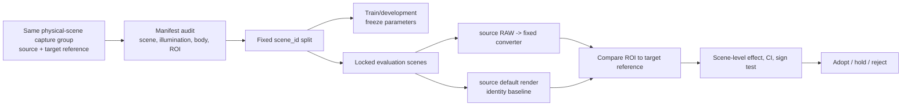

# Counterfactual-free cross-camera generalization evaluation (Protocol 2R design)

Protocol 2R validates the Layer B appearance residual of the [EAGER
Framework](2026-09-08-eager-framework-design.en.md). Its colorimetric
foundation, evidence tier, lockbox, artifact, and validator rules come from
EAGER.

## Problem

The original Protocol 2 applies Sony/Nikon/Canon `apply_*_look()` functions to
the **same base image**, then inverts them. Because each forward and inverse
mapping nearly cancel, identical post-conversion b2 values can reconstruct the
shared input rather than demonstrate camera generalization. Comparing output
distributions from unrelated scenes is not an answer either: scene content,
illumination, and exposure then confound camera effects.

Protocol 2R therefore does not infer generalization from indirect distributional
convergence. It measures whether a source-camera input moves closer to a real
target-camera reference of the **same physical scene**. Data without such a
reference remain exploratory and cannot support a generalization claim.

## Claim boundary

Protocol 2R can support exactly this claim:

> A fixed converter makes held-out physical scenes from a source camera closer
> to the target camera's reference rendering.

It cannot establish target-RAW reconstruction, fingerprint removal, or
universal performance across scenes, illumination, and bodies.

## Data contract

The independent unit is a **physical-scene capture group**, containing source
and target captures of the same static scene.

| Field | Required | Purpose |
|---|---:|---|
| `scene_id` | Yes | Independent holdout/bootstrap unit |
| `source_body`, `target_body` | Yes | Body-bias decomposition |
| source RAW and target RAW/JPEG reference | Yes | Direct target-error measurement |
| `illumination_id` | Yes | Leakage and illumination-bias detection |
| lens, focal length, exposure metadata | Yes | Matchability checks |
| alignable ROI or chart-patch coordinates | Yes | Avoid motion/composition contamination |
| capture timestamp and operator note | Recommended | Audit simultaneity and scene change |

### Exclusions

- Re-encodes, crops, or reprocesses of one scene are technical repeats under one
  `scene_id`, not independent samples.
- Pairs with moving subjects, changed illumination, or failed ROI alignment are
  excluded before analysis with a reason recorded in the manifest.
- Synthetic Sony/Nikon/Canon inputs generated from a shared base image are
  excluded from effect sizes, confidence intervals, and win/loss counts. They
  may only smoke-test code paths.
- Chart-only groups are reported separately as native-to-XYZ/white-balance
  evidence; they are not pooled with scene-rendering generalization.

## Pre-registration and split

1. Freeze converter version, target profile, decoder, resize policy, ROI rules,
   metrics, and exclusions in `protocol_2r_manifest.csv` and the run command.
2. Split by `scene_id` into train/development/evaluation. No body, exposure, or
   crop of one scene may cross a split boundary.
3. Select any parameters only on train/development data. Open final evaluation
   once; later changes require a new version and evaluation split.
4. Stratify bodies and illumination where feasible. Do not make claims for a
   body or condition found in only one split.

## Measurement

For each evaluation scene \(s\), compare its source default render and its
converted render against the target reference in the same ROI. To avoid treating
alignment uncertainty as pixel-level color error, first form median Lab values
from small blocks or semantically uniform patches, then average patch ΔE00.

\[
e_{base,s}=\operatorname{mean}_{p \in ROI_s}\Delta E_{00}(base_{s,p}, target_{s,p})
\]
\[
e_{conv,s}=\operatorname{mean}_{p \in ROI_s}\Delta E_{00}(converted_{s,p}, target_{s,p})
\]
\[
d_s=e_{base,s}-e_{conv,s}
\]

`d_s > 0` is improvement. If multiple source bodies capture one scene, average
within the scene before statistics; patches and crops never become independent
samples.

Primary outcomes are scene-level ΔE00 improvement, separately reported neutral
and chromatic-patch improvement, and luminance/white-point error. Secondary
safety outcomes are luminance SSIM change, clipping/black/white quantiles, and
body/illumination decompositions. Secondary outcomes do not replace ΔE00.

## Falsification controls

| Control | Expected result | Failure means |
|---|---|---|
| Identity baseline | Defines `d_s` | Converter effect is undefined |
| Target-reference shuffle | Must not pass | Scene/reference mismatch or metric leakage |
| Source-label shuffle | Must not beat true mapping | Chance/body-label artifact or code error |
| Holdout rerun | Same result on fixed input | Nondeterministic decoder or environment leakage |
| Input chart positive control | Reproduces known native-to-XYZ gain | Evaluation pipeline is unsound |

Controls are reported separately from the effect size and CI. A failed control
invalidates the result.

## Statistics and decision

Use `scene_id` as the independent unit. For `d_s`, run the project's standard
two-sided sign test, fixed-seed 20,000-draw paired-bootstrap 95% CI, and
drop-one sensitivity analysis. Use scene-level stratified bootstrap when body
and illumination strata are large enough; otherwise report raw strata without
declaring stratum-specific winners.

| Evidence tier | Minimum data | Permitted conclusion |
|---|---|---|
| Feasibility | Fewer than 5 scenes | Alignment, decoder, and control operation only |
| Exploratory | 5–11 scenes | Record direction; no adoption/rejection |
| Evaluation | At least 12 independent scenes and 2 illumination conditions | Hold/reject with CI and controls |
| Strong external evidence | At least 20 scenes, 2 source bodies, 3 illumination conditions | Limited-scope generalization claim |

Adoption requires all of the following: the paired-bootstrap 95% CI lower bound
is positive; the two-sided sign test has `p < 0.05`; neither neutral nor
chromatic primary outcome regresses; no body or illumination stratum has a
material hidden regression; and all controls work as expected. Any CI containing
zero is **inconclusive**. This protocol does not itself authorize deployment.

## Relationship to Protocol 2

Existing Protocol 2 values remain historical observations from a shared-base
synthetic route. They must not be cited as real cross-camera-generalization
evidence. Protocol 2R adds a separate manifest, run log, and table when common
physical-scene data become available.

## Implementation checklist

- [ ] Obtain a manifest with scene, illumination, body, and ROI metadata.
- [ ] Record provenance hashes for source and target files.
- [ ] Freeze the `scene_id` split before tuning.
- [ ] Write identity, shuffle, and positive-control tests first.
- [ ] Test scene-level aggregation against patch/crop double counting.
- [ ] Record actual numbers and the command in `EVALUATION.md`.
- [ ] Request separate user approval for any deployment decision.

## Current status

This is a methodology design. No common-scene dataset or manifest is currently
available, so it asserts no effect size, success, or generalization result.
