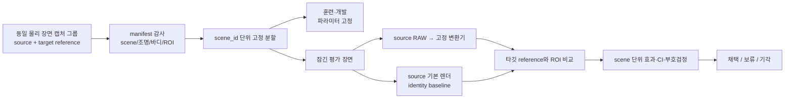

# 반사실 없는 교차 카메라 일반화 평가 방법론 (Protocol 2R 설계)

## 문제

기존 Protocol 2는 Sony/Nikon/Canon의 `apply_*_look()`을 **같은 한 장의
base image**에 적용한 뒤 다시 역변환했다. 각 브랜드의 forward/ inverse가
서로 거의 상쇄되므로, 변환 후 b2가 셋 다 10.0으로 같아진 결과는 카메라
일반화의 증거가 아니라 입력을 재구성한 결과일 수 있다. 서로 다른 실제
장면의 출력 분포만 비교하는 방식도 장면 내용·조명·노출 차이를 카메라
차이와 분리할 수 없어서 답이 아니다.

따라서 Protocol 2R는 “입력 카메라에 덜 의존하는가”를 간접 분포 수렴으로
주장하지 않는다. **같은 물리 장면을 타깃 카메라가 실제로 촬영한 참조
렌더에 얼마나 가까워지는가**를 장면 단위로 측정한다. 참조가 없는 데이터는
일반화 성능 주장에 쓰지 않고 탐색적 관찰로만 남긴다.

## 주장 범위

Protocol 2R가 검증할 수 있는 주장은 다음 한 문장이다.

> 고정된 변환기가, 학습·튜닝에 사용하지 않은 물리 장면에서 source-camera
> 입력을 target-camera 참조 렌더에 더 가깝게 만든다.

이 방법은 “source RAW를 target RAW로 복원한다”, “카메라 고유 노이즈를
제거한다”, “아무 장면·조명·바디에도 일반화된다”를 주장하지 않는다. 그런
주장은 별도 실험과 별도 데이터가 필요하다.

## 데이터 계약

평가 단위는 픽셀이 아니라 **물리 장면 캡처 그룹**이다. 한 그룹에는 같은
정지 장면을 source body와 target body가 촬영한 파일이 들어간다.

| 필드 | 필수 | 목적 |
|---|---:|---|
| `scene_id` | 예 | 홀드아웃·부트스트랩의 독립 단위 |
| `source_body`, `target_body` | 예 | 바디 편향 분해 |
| source RAW와 target RAW/JPEG reference | 예 | 직접적인 타깃 오차 계산 |
| `illumination_id` | 예 | 조명별 누수·편향 탐지 |
| lens, focal length, exposure metadata | 예 | 매칭 가능성 검사 |
| 정렬 가능한 ROI 또는 chart patch 좌표 | 예 | 움직임·구도 차이의 픽셀 오차 오염 방지 |
| capture timestamp·operator note | 권장 | 동시성/장면 변화 감사 |

### 제외 규칙

- 같은 장면을 재압축·크롭·재현상한 파생본은 별도 표본이 아니라 한
  `scene_id` 안의 기술 반복으로 묶는다.
- 움직이는 피사체, 바뀐 조명, 다른 구도 때문에 ROI 정합이 실패한 쌍은
  분석 전에 제외 사유와 함께 manifest에 기록한다. 결과를 보고 제외하면
  안 된다.
- 공통 base image에서 인위적으로 만든 Sony/Nikon/Canon 입력은 이 프로토콜의
  효과 크기·CI·승패에 넣지 않는다. 코드 경로가 실행되는지만 확인하는
  스모크 테스트에만 쓴다.
- chart-only 그룹은 matrix/white-balance 단계의 외적 타당성 근거로 따로
  보고하며, 실제 장면 렌더 일반화 수치와 합산하지 않는다.

## 사전 등록과 분할

1. 변환기 버전, target profile, RAW decoder, resize 정책, ROI 규칙,
   평가지표, 제외 규칙을 `protocol_2r_manifest.csv`와 실행 명령에 먼저
   고정한다.
2. 모든 `scene_id`를 훈련/개발/평가로 나눈다. 같은 `scene_id`의 어떤
   카메라·노출·크롭도 둘 이상의 분할에 들어가지 않는다.
3. 파라미터를 고를 일이 있으면 훈련/개발 분할에서만 고른다. 최종 평가는
   한 번만 열고, 이후 변경은 새 버전·새 평가 분할로 취급한다.
4. 바디 또는 조명 조건이 하나의 분할에만 몰리지 않도록 층화한다. 불가능한
   경우 그 바디/조명에 대한 일반화 주장은 하지 않는다.

## 측정

각 평가 장면 (s)에서 source 기본 렌더와 변환 렌더를 같은 ROI의 target
reference와 각각 비교한다. 기하 정합 불확실성을 픽셀 단위 색 오차로
착각하지 않도록, ROI 안에서 먼저 작은 블록 또는 의미상 균질한 patch의
median Lab을 만들고 그 patch들의 ΔE00을 평균낸다.

\[
e_{base,s}=\operatorname{mean}_{p \in ROI_s}\Delta E_{00}(base_{s,p}, target_{s,p})
\]
\[
e_{conv,s}=\operatorname{mean}_{p \in ROI_s}\Delta E_{00}(converted_{s,p}, target_{s,p})
\]
\[
d_s=e_{base,s}-e_{conv,s}
\]

`d_s > 0`이 변환의 개선이다. patch를 독립 표본으로 세지 않으며, 여러
source body가 같은 장면을 찍었다면 장면 안의 `d_s`를 먼저 평균내서 한
scene-level 값만 통계에 넣는다.

### 1차 지표

- 장면별 평균 ΔE00 개선 `d_s`
- 장면별 neutral patch와 chromatic patch 개선을 별도 보고
- 장면별 luminance/white-point 오차를 별도 보고

색상 개선 하나가 노출 보정으로 위장되는 일을 막기 위해 neutral/chromatic
결과가 반대 방향이면 통합 평균만으로 승자를 선언하지 않는다.

### 2차 안전 지표

- ROI의 구조 보존: 기준 렌더 대비 luminance SSIM 변화
- clipping 비율과 흑점/백점 분위수 변화
- source body별·illumination별 `d_s` 분해

2차 지표는 1차 ΔE00의 대체물이 아니다. 평균 ΔE00이 좋아도 특정 바디,
특정 조명, 또는 clipping에서 체계적으로 나빠지면 결과는 보류한다.

## 반증 통제

통과 결과를 신뢰하려면 아래 통제를 같은 실행에서 통과해야 한다.

| 통제 | 기대 결과 | 실패가 뜻하는 것 |
|---|---|---|
| identity baseline | `d_s`의 기준선 | 변환 효과를 정의할 수 없음 |
| target-reference shuffle | 개선이 통과하면 안 됨 | 장면/참조 매칭 또는 지표 누수 |
| source-label shuffle | 실제 매핑보다 좋아지면 안 됨 | source body 효과가 아닌 우연/코드 오류 |
| holdout scene 재실행 | 고정 입력에서 동일 결과 | 비결정적 decoder 또는 환경 누수 |
| 입력 색상표 양성 통제 | 이미 알려진 native→XYZ 개선 재현 | 평가 파이프라인 자체 이상 |

shuffle 통제는 효과 크기·CI와 분리해 보고한다. 통제가 우연히 통과했다고
실험이 성공하는 것은 아니지만, 통제가 실패하면 본 결과는 무효다.

## 통계와 판정

독립 단위는 `scene_id`다. `d_s`에 대해 프로젝트 표준과 같은 양측
부호검정, 고정 seed 20,000회 paired bootstrap 95% CI, drop-one 민감도
분석을 낸다. 바디/조명 층이 충분하면 장면 단위 층화 bootstrap을 사용하고,
층별 표본이 작으면 전체 CI와 층별 원자료를 함께 제시하며 층별 승자 선언은
하지 않는다.

| 증거 등급 | 최소 데이터 | 가능한 결론 |
|---|---|---|
| 실행 가능성 | 5개 미만 장면 | 정합·decoder·통제 작동 여부만 |
| 탐색 | 5–11 장면 | 방향성 기록, 채택/기각 금지 |
| 평가 | 12개 이상 독립 장면, 2개 이상 조명 조건 | CI와 통제를 포함한 보류/기각 가능 |
| 강한 외적 근거 | 20개 이상 장면, 2개 이상 source body, 3개 이상 조명 조건 | 제한된 범위의 일반화 주장 가능 |

채택에는 모두 필요하다.

1. 평가 장면의 paired-bootstrap 95% CI 하한이 0보다 크다.
2. 양측 부호검정 `p < 0.05`이다.
3. neutral와 chromatic 1차 지표가 둘 다 악화하지 않는다.
4. source body와 illumination 분해에서 한 층의 큰 악화를 평균이 숨기지
   않는다. 층별 표본이 작다면 “보류”로 남긴다.
5. 네 반증 통제가 모두 예상대로 작동한다.

어느 하나라도 실패하거나 CI가 0을 포함하면 결과는 **판정 보류**다. 이
프로토콜은 배포 승인을 자동으로 주지 않는다. 배포 후보가 생기면 shipped
`apply_*`/profile 변경은 별도의 사용자 승인과 별도 회귀 검증을 거친다.

## 기존 Protocol 2와의 관계

기존 수치는 지우거나 재해석하지 않는다. `hybrid_engine/EVALUATION.md`의
Protocol 2 표는 “공통 base image 합성 경로에서 관찰한 수렴/노이즈 지표”라는
역사적 기록으로 유지한다. 다만 이를 real cross-camera generalization의
증거로 인용하지 않는다. Protocol 2R 결과는 새 표와 새 manifest, 새 실행
로그를 가진 별도 측정으로 추가한다.

## 구현 전 체크리스트

- [ ] 장면·조명·바디·ROI가 있는 manifest 확보
- [ ] target-reference와 source 파일의 provenance hash 기록
- [ ] `scene_id` 단위 분할을 먼저 고정
- [ ] identity/shuffle/양성 통제 테스트를 먼저 작성
- [ ] scene-level 집계가 patch·크롭의 중복 카운트를 막는지 테스트
- [ ] 실제 수치를 `EVALUATION.md`에 표와 실행 명령으로 기록
- [ ] 배포 여부는 측정 결과와 별도로 사용자 승인 요청

## 현재 상태

이 문서는 방법론 설계다. 실제 공통 장면 데이터와 manifest가 아직 없으므로,
효과 크기·성공 여부·일반화 성능 수치는 주장하지 않는다.
