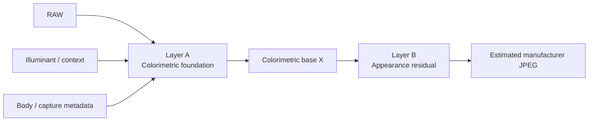

# EAGER Framework design

EAGER means **Empirical Appearance Generalization, Evidence & Reconstruction**.
It joins HNCS's empirical manufacturer-JPEG reconstruction with strict rules
for colorimetry, provenance, independent validation, and deployment evidence.

## 1. Claim boundary

HNCS observes a manufacturer JPEG result \(J\). Its model target is therefore

\[
\hat J=f(R,I,C;\theta)
\]

where \(R\) is RAW, \(I\) is illuminant/context, \(C\) is body/lens/capture
metadata, and \(\theta\) is estimated appearance parameters.

The allowed claim is only that an observed manufacturer rendering was reproduced
for the data and evaluation scope. Reconstructing an internal manufacturer
algorithm or generalizing beyond observed cameras, illumination, or scenes needs
separate evidence.

## 2. Two-layer model



### Layer A — Colorimetric foundation

\[
X=C_\phi(R,I)
\]

Use evidence in this order: sensor spectral sensitivity plus illuminant SPD;
spectral ColorChecker reference plus measured illumination; RAW/DNG metadata
matrix; then a documented raw-decoder fallback. Record whether each input exists
and its provenance. A fallback is not failure, but lowers the evidence tier and
claim scope.

### Layer B — Appearance residual

\[
\hat J=A_\theta(X)
\]

Model only manufacturer-rendering residuals: tone, hue, chroma, gamut mapping,
local contrast, texture, and film simulation. A decoder, white-balance, or
matrix error absorbed as appearance is not appearance-reconstruction evidence.

## 3. Evidence tier

| Tier | Minimum evidence | Permitted conclusion |
|---|---|---|
| A | SSF, illuminant spectrum, RAW/JPEG, spectral target | Strong colorimetric and appearance conclusion |
| B | Spectral ColorChecker and multi-illuminant RAW/JPEG | Camera-specific correction and appearance conclusion |
| C | Many same-shot RAW/JPEG pairs | Limited appearance reconstruction |
| D | Provenance-valid manufacturer JPEG population | Population-level appearance statistics |
| E | Visual or subjective tuning | Exploratory only |

Lower-tier data never promote a higher-tier claim. In particular, JPEG
populations cannot establish a sensor matrix or physical camera response.

## 4. Acquisition and measurement QA

For ColorChecker or common-scene captures, record illuminant identity and, where
possible, spectrum; neutral/white reference, exposure, clipping; illumination
uniformity, glare, flat-field availability; dark-patch noise/glare; body, lens,
focal length, decoder/version; source/target hashes; capture group; and exclusion
reason. More images or patches are not a substitute for good reference
measurement. Keep RAW preprocessing minimal and record every applied step.

## 5. Model ladder and selection-leak prevention

Compete models only in this order:

```text
identity
→ exposure / white balance
→ 3×3 matrix
→ matrix + parametric tone
→ matrix + 1D LUT
→ 3D LUT or a more complex nonlinear model
```

A complex candidate is eligible only if it beats its immediately simpler model
on holdout data. A large LUT above an unstable matrix may be correcting a
foundation error rather than discovering appearance.

Split capture groups into discovery, validation, and lockbox:

\[
D=D_{discovery}\cup D_{validation}\cup D_{lockbox}
\]
\[
D_{lockbox}\cap\text{model selection}=\varnothing
\]

Discovery permits search; validation compares fixed candidates; lockbox is opened
once for final selection. Changing a model after opening lockbox requires a new
lockbox.

## 6. Independent unit and generalization question

Count independent capture groups, not images. Derivatives from one burst, scene,
session, contributor, illuminant setup, or body are not independent samples.

| Question | Default split |
|---|---|
| Session generalization within body | Leave-one-session-out |
| Photographer/contributor generalization | Leave-one-contributor-out |
| Cross-body generalization | Leave-one-body-out |
| Cross-illuminant generalization | Leave-one-illuminant-out |
| Cross-camera appearance | Same-physical-scene target-reference holdout |

The last procedure is specified by [Protocol 2R](2026-09-08-cross-camera-generalization-methodology-design.en.md). Synthetic sources from a shared base image are code-path smoke tests only, never generalization statistics.

## 7. Measurement and ship gate

The primary outcome is group-level paired ΔE00 improvement:

\[
d_i=E_{baseline,i}-E_{candidate,i}
\]

Report ΔL*, ΔC*, hue error, neutral-axis error, skin/saturated/shadow/highlight
subsets, p50/p90, luminance SSIM, tone deviation, and gamut/clipping separately.
An aggregate improvement is not a universal improvement.

A final candidate must exceed a pre-registered practical improvement threshold
\(\delta\), and on validation or lockbox must have a paired-bootstrap 95% CI
excluding zero, a passing two-sided paired sign test, and no material hidden
regression in the body/illumination/scene/exposure/saturation/contributor/decoder
robustness matrix. HNCS's default shipped-candidate gate is 5%. A CI containing
zero is **Inconclusive**. Discovery statistics are not ship-gate evidence.

## 8. Physical/perceptual sanity constraints

The objective is not merely \(\min E\), but

\[
\min E \quad \text{subject to physical/perceptual constraints}
\]

Check neutral-axis bend, matrix determinant/condition, gamut clipping, hue
discontinuity, LUT folding, and tone monotonicity. A small ΔE00 gain that breaks
one of these constraints is rejected or held.

## 9. Frozen artifacts and sample accounting

Freeze reference outputs, parameter JSON, metrics, dataset manifest, provenance
hashes, generation command, and regression artifacts for a ship candidate. Tests
must never regenerate golden output automatically; intentional regeneration needs
separate review.

Every report reconciles:

```text
requested → downloaded → decoded → provenance_valid → paired
→ group_valid → evaluated
```

Break exclusions down by reason, for example `decode_failure`, `corrupt_image`,
`wrong_model`, `edited_jpeg`, `pair_mismatch`, `duplicate`, `missing_exif`, and
`unsupported_raw`, such that

\[
N_{requested}=N_{evaluated}+\sum N_{excluded,reason}
\]

## 10. Recursive and independent validation

A passing validator becomes evidence only after mutation tests show it can fail.
Inject deletion, pair mismatch, profile/ICC/DCP corruption, discovery=0,
manifest-count drift, bad provenance, duplicates, and invalid CI results.

> A passing validator is evidence only after its ability to fail has been demonstrated.

Confirm important results through independent implementations where possible:
local ΔE00 versus `colour-science`, local ICC parsing versus exiftool/littlecms,
or matrix fitting versus a separate NumPy calculation. Calculating and testing
with one function is not independent verification.

## 11. Result classification

| Classification | Meaning |
|---|---|
| Verified | Passed lockbox and has external replication or independent-implementation evidence |
| Supported | Passed validation without external replication |
| Inconclusive | CI, robustness, or evidence tier is insufficient |
| Rejected | Holdout generalization fails or a conditional regression is established |
| Exploratory | Tier D/E or discovery-only observation |

This classification does not authorize a shipped-artifact change. Deployment
requires separate user approval, renderer checks, and artifact-integrity tests.
