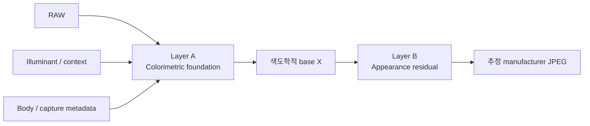

# EAGER Framework 설계

EAGER는 **Empirical Appearance Generalization, Evidence & Reconstruction**의
약자다. HNCS의 경험적 제조사 JPEG 재현과 엄격한 색도학·데이터 계보·독립
검증 규칙을 하나의 방법론으로 묶는다.

실사진 appearance 검증의 메인 실행 프로토콜은 [NARE](2026-09-08-nare-natural-scene-protocol.md)다. ColorChecker는 supporting
colorimetric evidence, Protocol 2R는 동일 물리 장면을 요구하는 교차 카메라
확장으로 분리한다.

## 1. 주장 경계

HNCS가 관측하는 것은 제조사 JPEG 결과 (J)다. 따라서 모델의 목표는

\[
\hat J = f(R, I, C; \theta)
\]

이며, (R)은 RAW, (I)는 조명/문맥, (C)는 body·lens·capture metadata,
\(\theta\)는 추정된 appearance parameter다.

허용되는 주장은 “관측된 제조사 rendering을 이 데이터와 이 평가 범위에서
재현했다”까지다. 제조사 내부 알고리즘을 복원했다거나, 데이터에 없는
카메라·조명·장면으로 일반화된다는 주장은 별도 증거 없이는 금지한다.

## 2. 두 층 모델



### Layer A — Colorimetric foundation

\[
X=C_\phi(R,I)
\]

RAW 센서와 조명의 기초 오차를 다룬다. 증거가 강한 순서대로 다음을 사용한다.

1. 센서 spectral sensitivity와 illuminant SPD
2. spectral ColorChecker reference와 실제 조명 기록
3. RAW/DNG metadata matrix
4. raw decoder의 documented fallback

각 입력이 실제로 존재하는지와 provenance를 기록한다. fallback은 실패가
아니지만, 그 결과의 evidence tier와 주장 범위를 낮춘다.

### Layer B — Appearance residual

\[
\hat J=A_\theta(X)
\]

tone, hue, chroma, gamut mapping, local contrast, texture, film simulation처럼
제조사 rendering에 해당하는 잔차만 모델링한다. Layer A의 decoder·white
balance·matrix 오류를 appearance로 흡수시킨 결과는 appearance reconstruction
증거가 아니다.

## 3. Evidence tier

| Tier | 최소 증거 | 허용되는 결론 |
|---|---|---|
| A | SSF, illuminant spectrum, RAW/JPEG, spectral target | 강한 colorimetric 및 appearance 결론 |
| B | spectral ColorChecker, 다중 조명 RAW/JPEG | camera-specific correction 및 appearance 결론 |
| C | 동일 촬영의 다수 RAW/JPEG pair | 제한된 appearance reconstruction |
| D | provenance가 있는 제조사 JPEG population | population-level appearance 통계 |
| E | 시각 조정 또는 주관 평가 | exploratory only |

낮은 tier의 데이터가 높은 tier의 주장을 승격시키지 않는다. 특히 JPEG
population으로 센서 matrix나 물리적 camera response를 주장하지 않는다.

## 4. 획득과 측정 QA

ColorChecker 또는 공통 장면 캡처에는 아래를 manifest에 남긴다.

- illuminant identity와 가능하면 spectrum
- neutral/white reference, 노출, clipping 여부
- 조명 균일성, glare, flat-field 보정 가능 여부
- dark patch의 noise/glare 상태
- body, lens, focal length, decoder와 version
- source/target hash, capture group, 제외 사유

많은 patch나 이미지는 좋은 reference measurement의 대체물이 아니다. RAW
preprocessing은 최소화하고, 적용했다면 단계와 파라미터를 재현 가능하게
기록한다.

## 5. 모델 사다리와 선택 누수 방지

모델은 단순한 순서로만 경쟁시킨다.

```text
identity
→ exposure / white balance
→ 3×3 matrix
→ matrix + parametric tone
→ matrix + 1D LUT
→ 3D LUT 또는 더 복잡한 nonlinear model
```

복잡한 모델은 holdout에서 바로 아래 단순 모델을 이길 때만 채택 후보가
된다. matrix가 불안정한 상태에서 LUT가 커지는 것은 appearance 발견이 아니라
기초 오차를 보정하는 과적합일 수 있다.

데이터는 capture group 단위로 discovery, validation, lockbox로 나눈다.

\[
D=D_{discovery}\cup D_{validation}\cup D_{lockbox}
\]
\[
D_{lockbox}\cap\text{model selection}=\varnothing
\]

discovery에서는 grid search와 feature/model 탐색을 허용한다. validation은
고정 후보 비교만, lockbox는 최종 선택에 한 번만 쓴다. lockbox를 다시 열어
모델을 바꾸면 새 lockbox가 필요하다.

## 6. 독립 단위와 일반화 질문

이미지 수가 아니라 독립 capture group 수를 표본으로 센다. 같은 burst,
scene, session, contributor, illuminant setup, body의 파생본은 독립 표본이
아니다.

| 질문 | 기본 분할 |
|---|---|
| 같은 body에서 세션 일반화 | leave-one-session-out |
| 다른 photographer/contributor 일반화 | leave-one-contributor-out |
| body 간 일반화 | leave-one-body-out |
| 조명 간 일반화 | leave-one-illuminant-out |
| cross-camera appearance | same-physical-scene target-reference holdout |

마지막 행의 세부 절차는 [Protocol 2R](2026-09-08-cross-camera-generalization-methodology-design.md)에서 정의한다. 공통 base image로 만든 synthetic source는 code-path smoke test일 뿐 generalization 통계에 넣지 않는다.

## 7. 측정과 ship gate

주 지표는 group-level paired ΔE00 개선이다.

\[
d_i=E_{baseline,i}-E_{candidate,i}
\]

보조로 ΔL*, ΔC*, hue error, neutral-axis error, skin/saturated/shadow/highlight
subset, p50/p90, luminance SSIM, tone deviation, gamut/clipping을 분리 보고한다.
평균 개선은 모든 조건의 개선을 뜻하지 않는다.

최종 후보는 사전에 정한 실질 개선 한계 \(\delta\)를 넘고, validation 또는
lockbox에서 다음을 모두 만족해야 한다.

1. paired bootstrap 95% CI가 0을 포함하지 않는다.
2. 양측 paired sign test가 통과한다.
3. 개선이 \(\delta\) 이상이다. 기본값은 프로젝트별로 사전 등록하며,
   HNCS shipped 후보의 기본 gate는 5%다.
4. body, illuminant, scene, exposure, saturation, contributor, decoder
   sensitivity의 robustness matrix에서 aggregate 평균이 숨긴 중대한 회귀가 없다.

CI가 0을 포함하면 평균이 좋아도 **Inconclusive**다. discovery 결과에서
직접 유의성을 계산해 ship gate로 쓰지 않는다.

## 8. Physical/perceptual sanity constraints

목적은 단순히 \(\min E\)가 아니라 다음 제약을 가진 최소화다.

\[
\min E \quad \text{subject to physical/perceptual constraints}
\]

후보마다 neutral-axis bend, matrix determinant/condition, gamut clipping,
hue discontinuity, LUT folding, tone monotonicity를 검사한다. 작은 ΔE00
개선이 이 제약을 깨면 후보는 기각 또는 보류다.

## 9. Frozen artifact와 sample accounting

ship 후보의 reference output, parameter JSON, metrics, dataset manifest,
provenance hash, generation command, regression artifact를 함께 고정한다.
테스트는 golden output을 자동 재생성하지 않는다. 의도적 변경은 별도
regeneration과 review를 요구한다.

모든 리포트는 다음 reconciliation을 낸다.

```text
requested → downloaded → decoded → provenance_valid → paired
→ group_valid → evaluated
```

제외는 `decode_failure`, `corrupt_image`, `wrong_model`, `edited_jpeg`,
`pair_mismatch`, `duplicate`, `missing_exif`, `unsupported_raw`처럼 이유별로
분해한다.

\[
N_{requested}=N_{evaluated}+\sum N_{excluded,reason}
\]

## 10. Recursive와 독립 검증

validator가 통과했다는 사실은 validator가 실패할 수 있음을 보인 뒤에만
증거가 된다. 삭제, pair mismatch, profile/ICC/DCP corruption, discovery=0,
manifest count drift, bad provenance, duplicate, invalid CI를 의도적으로
주입하는 mutation test를 둔다.

> A passing validator is evidence only after its ability to fail has been demonstrated.

중요 수치는 가능한 한 독립 구현으로도 확인한다. 예: 자체 ΔE00와
`colour-science`, 자체 ICC parser와 exiftool/littlecms, matrix fit과 별도
NumPy 계산을 비교한다. 동일 함수로 계산하고 동일 함수로 검증하는 것은
독립 검증이 아니다.

## 11. 결과 분류

| 분류 | 의미 |
|---|---|
| Verified | lockbox까지 통과했고 외부 재현 또는 독립 구현 검증이 있다 |
| Supported | validation은 통과했지만 외부 재현은 없다 |
| Inconclusive | CI, robustness, 또는 evidence tier가 부족하다 |
| Rejected | holdout 일반화 실패 또는 조건부 악화가 확인됐다 |
| Exploratory | tier D/E 또는 discovery-only 관찰이다 |

이 분류는 shipped artifact 변경 권한이 아니다. deployment는 별도 사용자
승인, renderer 검증, artifact integrity 검사를 거친다.

## 12. 구현 상태

`hybrid_engine/evaluation/eager.py`가 다음 계약을 실행한다.

- manifest 필수 필드·SHA-256 형식·scene split 누수 검사
- requested→evaluated와 제외 사유의 sample accounting reconciliation
- 기술 반복을 scene-level 독립 단위로 접는 집계
- paired bootstrap 95% CI와 exact sign test
- neutral/chromatic subgroup·control·robustness를 포함한 ship gate 분류
- matrix/tone/LUT의 finite·monotonic·clipping sanity 검사
- `eager_cli.py`를 통한 manifest + metric/control JSON 재현 실행

렌더러, ROI 추출, shuffle 실험 자체는 고의로 이 커널 밖에 둔다. CLI는
그 결과를 읽고 판정할 뿐, lockbox를 열거나 golden artifact를 자동 생성하지
않는다.
